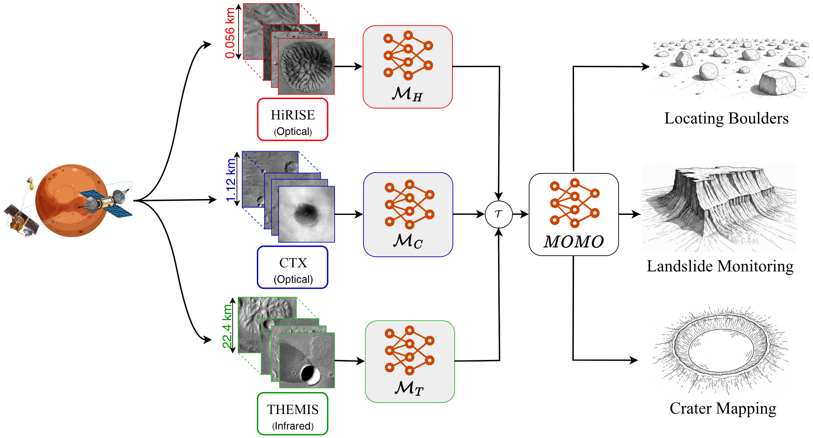

<p align="center">
  
</p>

<p align="center">
  <a href="https://openaccess.thecvf.com/content/CVPR2026/html/Purohit_MOMO_Mars_Orbital_MOdel_Foundation_Model_for_Mars_Orbital_Applications_CVPR_2026_paper.html">📄 Paper</a> |
  <a href="https://huggingface.co/Mirali33/MOMO">🤗 HuggingFace</a> |
  <a href="https://huggingface.co/Mirali33/MOMO">📦 Model Checkpoints</a> |
  <a href="https://huggingface.co/datasets/Mirali33/MOMO-pretraining-data">🛢️ Pre-training Data</a> |
  <a href="https://mars-bench.github.io/">🏆  Mars-Bench (Downstream tasks)</a>
</p>

<p align="center">
  Mirali Purohit<sup>1,2</sup><sup>†</sup>, Bimal Gajera<sup>1*</sup>, Irish Mehta<sup>1*</sup>, Bhanu Tokas<sup>1*</sup>,<br/>
  Jacob Adler<sup>1</sup>, Steven Lu<sup>2</sup>, Scott Dickenshied<sup>1</sup>, Serina Diniega<sup>2</sup>,<br/>
  Brian Bue<sup>2</sup>, Umaa Rebbapragada<sup>2</sup>, Hannah Kerner<sup>1</sup>
</p>

<p align="center">
  <sup>1</sup>Arizona State University &nbsp;&nbsp;
  <sup>2</sup>Jet Propulsion Laboratory, California Institute of Technology<br/>
  <sup>*</sup>Equal Contribution &nbsp;&nbsp; <sup>†</sup>Corresponding Author
</p>

---

## Introduction

We introduce **MOMO**, the first multi-sensor foundation model for Mars remote sensing. MOMO uses model merging to integrate representations learned independently from three key Martian orbital sensors: **HiRISE**, **CTX**, and **THEMIS**; spanning resolutions from 0.25 m/pixel to 100 m/pixel.

Central to our method is a novel **Equal Validation Loss (EVL)** strategy, which aligns checkpoints across sensors based on validation loss similarity before fusion via task arithmetic. This ensures models are merged at compatible convergence stages, leading to improved stability and generalization.

MOMO is trained on approximately 12 million Mars orbital samples and evaluated on 9 downstream tasks from [Mars-Bench](https://arxiv.org/abs/2510.24010). It outperforms ImageNet pre-trained, Earth observation foundation model, sensor-specific pre-training, and fully-supervised baselines, with particularly consistent gains on segmentation tasks.

<p align="center">
  <br>
  <em>MOMO can be effectively applied across a wide range of resolutions and a broad spectrum of Martian remote sensing tasks, including large-scale crater or landslide mapping and precise boulder localization.</em>
</p>

---

## Installation

```bash
# Install the package with core dependencies
pip install -e .

# Install with development dependencies (for testing, linting, etc.)
pip install -e ".[dev]"
```

> Requires Python 3.10+ and CUDA 12.x for GPU support.

---

## Usage

Pre-trained model weights are available on [HuggingFace](https://huggingface.co/Mirali33/MOMO) for three ViT architectures (ViT-Small, ViT-Base, ViT-Large).

```python
import torch
from huggingface_hub import hf_hub_download

# Download MOMO ViT-Base checkpoint
path = hf_hub_download(repo_id="Mirali33/MOMO", filename="vit-b-16/momo.pth")
checkpoint = torch.load(path, map_location="cpu", weights_only=False)
```

Replace `vit-b-16` with `vit-s-16` or `vit-l-16` for other architectures, and `momo.pth` with `ctx.pth`, `hirise.pth`, `themis.pth`, or `hirise_ctx_themis.pth` for sensor-specific checkpoints.

### Model Checkpoints

| File | Description |
|------|-------------|
| `ctx.pth` | Pre-trained on CTX (ConTeXt Camera) |
| `hirise.pth` | Pre-trained on HiRISE (High Resolution Imaging Science Experiment) |
| `themis.pth` | Pre-trained on THEMIS (THermal EMission Imaging System) |
| `hirise_ctx_themis.pth` | Pre-trained jointly on all three sensors |
| `momo.pth` | MOMO merged model via task arithmetic + EVL (main contribution) |

---

## Citation

If you use MOMO in your research, please use the following citation:

```bibtex
@InProceedings{Purohit_2026_CVPR,
    author    = {Purohit, Mirali and Gajera, Bimal and Mehta, Irish and Tokas, Bhanu and Adler, Jacob and Lu, Steven and Dickenshied, Scott and Diniega, Serina and Bue, Brian and Rebbapragada, Umaa and Kerner, Hannah},
    title     = {MOMO: Mars Orbital MOdel Foundation Model for Mars Orbital Applications},
    booktitle = {Proceedings of the IEEE/CVF Conference on Computer Vision and Pattern Recognition (CVPR)},
    month     = {June},
    year      = {2026},
    pages     = {27772-27782}
}
```

### Contact Information

Please reach out to Mirali Purohit [mpurohi3@asu.edu](mpurohi3@asu.edu), if you have any queries or issues regarding MOMO.
